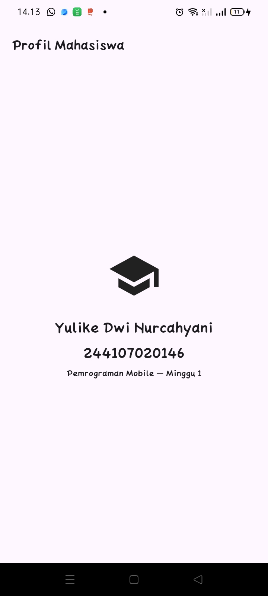

# my_first_app

Nama: Yulike Dwi Nurcahyani
NIM: 244107020146
Kelas: TI - 3E

## Pendahuluan
Pada pertemuan awal, materi berfokus pada pengenalan dasar ekosistem mobile development. Pembahasan mencakup sejarah perkembangan aplikasi mobile, komparasi pendekatan native, hybrid, dan cross-platform, serta arsitektur internal Flutter bersama bahasa Dart. Selain itu, dipelajari pula konsep fundamental seperti widget tree, struktur direktori proyek, penyegaran sintaks Dart (null safety), hingga konfigurasi lingkungan kerja (Flutter, Android SDK, Android Studio, dan emulator) sampai berhasil memodifikasi dan menjalankan aplikasi perdana.

## Fitur

* Bilah aplikasi (AppBar) bertajuk “Profil Mahasiswa”.
* Tampilan identitas diri berupa nama, NIM, dan ikon instansi pendidikan.
* Keterangan mata kuliah “Pemrograman Mobile — Minggu 1”.
* Pembersihan kode bawaan template (counter bawaan dihapus).

## Teknologi

| Teknologi | Kategori | Keterangan |
| :--- | :--- | :--- |
| **Flutter** | Framework | UI toolkit cross-platform |
| **Dart** | Bahasa | Bahasa pemrograman utama |
| **Android Studio** | Tool | Android SDK & Emulator |
| **VS Code** | Editor | Lingkungan penulisan kode |
| **Git** | Version Control | Pengelolaan repositori kode |

## Screenshoot
### Flutter Doctor

### Flutter Device

### Hasil Aplikasi
