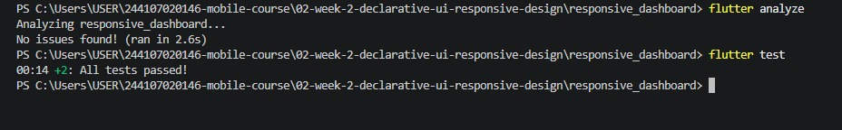

# responsive_dashboard

## Pendahuluan
Pada pertemuan ini, materi berfokus pada perancangan antarmuka deklaratif dan tata letak responsif menggunakan Flutter. Pembahasan mencakup penggunaan widget struktural dasar seperti Row, Column, Expanded, dan Container, hingga penerapan adaptabilitas layar menggunakan LayoutBuilder. Selain itu, dipelajari pula pengelolaan state dinamis melalui StatefulWidget untuk pergantian tema terang dan gelap (light/dark theme), pemanfaatan komponen hibrida Material dan Cupertino (CupertinoSwitch), penerapan standar aksesibilitas berbasis Semantics, serta pengujian responsivitas layout melalui widget testing.

## Fitur
- Bilah aplikasi (AppBar) bertajuk “Academic Overview” lengkap dengan sakelar tema dinamis (CupertinoSwitch).
- Dukungan penuh mode terang dan mode gelap (light/dark theme) yang adaptif terhadap preferensi pengguna.
- Header identitas profil mahasiswa yang rapi menggunakan perpaduan Container, Row, Column, dan Expanded.
- Tata letak grid responsif: menampilkan satu kolom pada layar sempit (lebar < 700px) dan dua kolom secara otomatis pada layar lebar (lebar ≥ 700px).
- Empat kartu metrik ringkasan akademik (IPK, Presensi, dan Tugas) yang dibuat modular (reusable widget).
- Label aksesibilitas (Semantics) pada tombol interaktif dan kartu informasi untuk mendukung pembaca layar (screen reader).

## Eksperimen warm-up
Membuat kartu profil sederhana

## Eksperimen layout

## Tugas utama
### Narrow

### Landscape

## AI Prompt Challenge
### A. Prompt Desain Tata Letak
Prompt: "Bandingkan dua tata letak dashboard akademik untuk Flutter: versi GridView dan versi LayoutBuilder + Column. Jelaskan trade-off responsif dan aksesibilitasnya."
Output:
GridView unggul untuk item homogen dan efisiensi memori, tetapi kaku karena terikat childAspectRatio yang rawan memicu overflow saat text scaling aktif.
LayoutBuilder + Column unggul dalam fleksibilitas tinggi konten intrinsik dan urutan navigasi fokus (focus traversal) aksesibilitas yang lebih alami.

### B. Prompt Penguatan Konsep
Prompt: "Jelaskan kapan penggunaan Expanded justru menyebabkan overflow di dalam Row, beri contoh kode yang gagal dan perbaikannya."
Output:
Expanded memicu eror jika diletakkan di dalam kontainer yang memiliki lebar tak terhingga (unbounded width), contohnya di dalam SingleChildScrollView(scrollDirection: Axis.horizontal).
Solusinya adalah membatasi lebar elemen dengan ukuran pasti (SizedBox/Container) atau meniadakan Expanded pada area scroll horizontal.

### C. Prompt Verifikasi & Audit
Prompt: "Periksa kembali rekomendasi layout di atas: apakah tetap responsif di bawah 600px, apakah mengurangi aksesibilitas, dan apakah ada widget yang tidak tersedia di Flutter stabil saat ini?"
Output:
Breakpoint 600px aman untuk membedakan mode layar ponsel (1 kolom) dan layar lebar (2 kolom).
Seluruh widget yang dipakai (LayoutBuilder, Semantics, CupertinoSwitch, ThemeData) merupakan pustaka stabil bawaan Flutter SDK tanpa dependensi eksternal.

## Testing dasar
### flutter analyze dan flutter test
