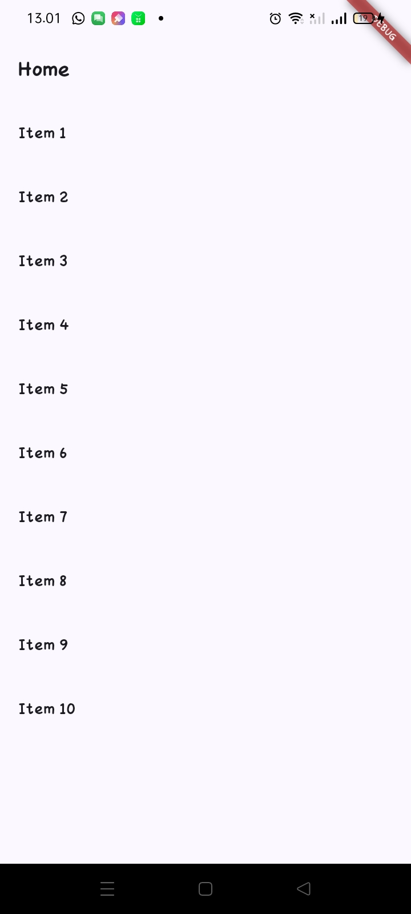
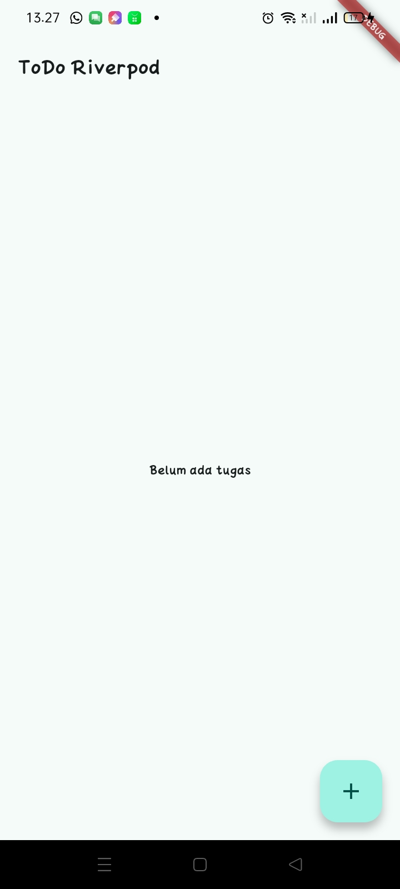
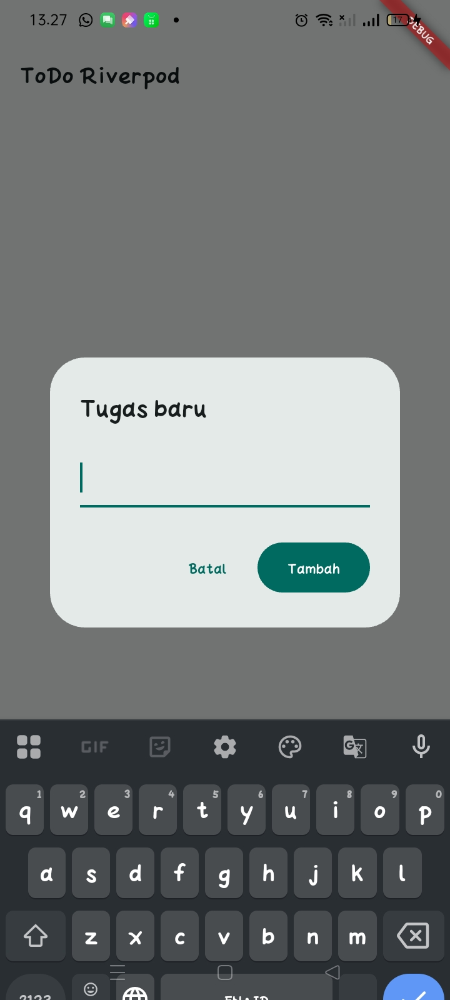
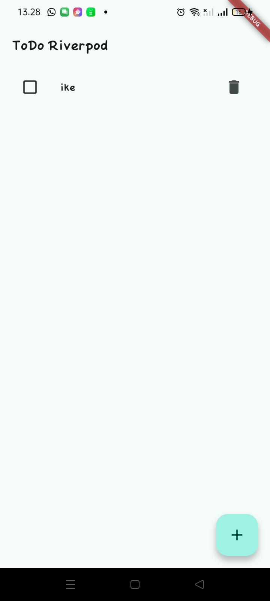
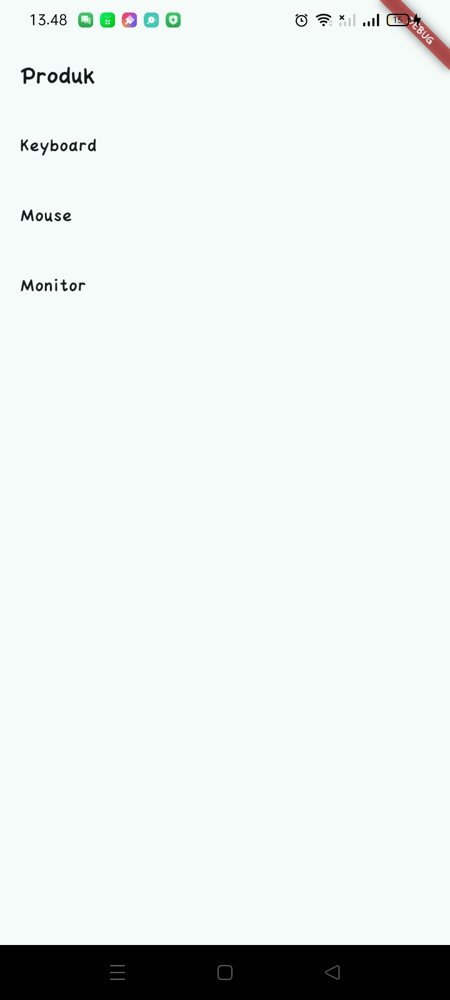
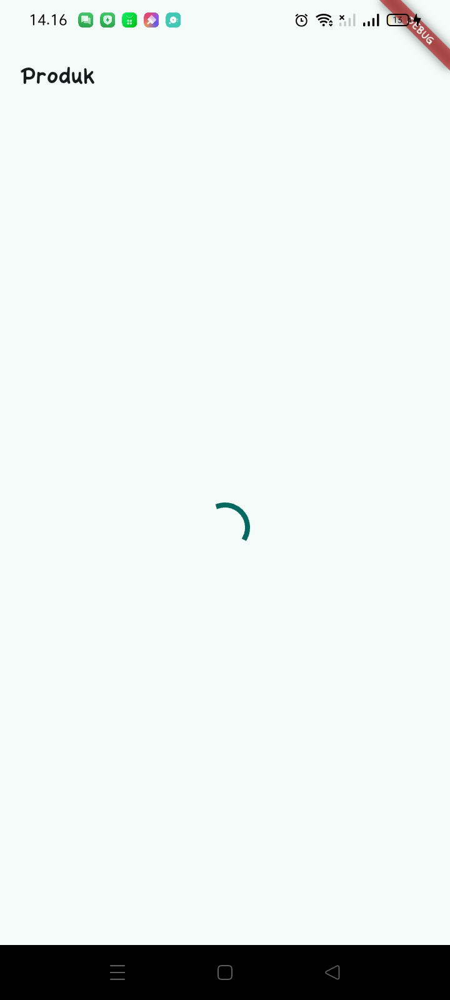
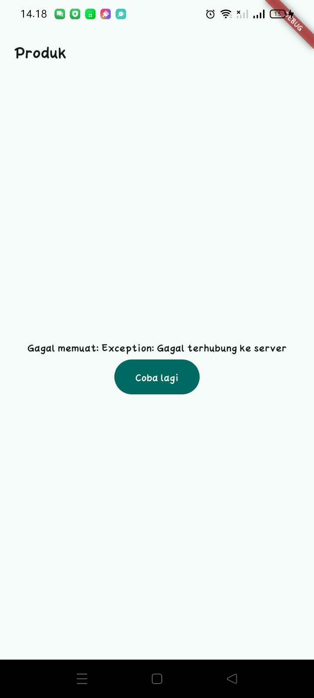

# 03 | Navigation & State Management

Proyek praktikum minggu ke-3 ini berfokus pada implementasi navigasi deklaratif menggunakan **GoRouter** dan arsitektur *state management* modern menggunakan **Riverpod 3** (`Notifier`, `NotifierProvider`, `ConsumerWidget`).

---

##  Tujuan Praktikum

1. Mengimplementasikan navigasi multi-halaman berbasis rute deklaratif (`/` dan `/stats`) menggunakan GoRouter.
2. Mempertahankan *state* antar halaman saat berpindah navigasi menggunakan `StatefulShellRoute`.
3. Mengelola state aplikasi secara *immutable* dan reaktif dengan Riverpod 3 tanpa pola lama (*anti-pattern* seperti `StateProvider`).
4. Menerapkan *clean code* dengan memisahkan widget komponen (`TodoTile`) dan provider turunan untuk fitur filter.
5. Memvalidasi keandalan kode melalui unit testing dan widget testing.

---

##  Fitur Utama

- **ToDo CRUD & Dynamic Filter:**
  - Tambah tugas baru via dialog interaktif.
  - Tandai selesai (*toggle*) dengan dekorasi coret (*strikethrough*).
  - Hapus tugas secara aman tanpa mutasi list langsung.
  - Filter tugas (*Semua*, *Belum Selesai*, *Selesai*) menggunakan provider turunan `filteredTodoListProvider`.
- **Halaman Statistik Dinamis (`StatsPage`):**
  - Menghitung secara *real-time* jumlah total tugas, tugas selesai, dan persentase penyelesaian berdasarkan daftar ToDo terkini.
  - Tampilan modular berbasis `ConsumerWidget` dan `ListView.separated`.
- **Navigasi GoRouter & Bottom Navigation Bar:**
  - Navigasi mulus antara halaman ToDo dan Statistik.
  - Status input dan posisi *scroll* tetap terjaga berkat `StatefulShellRoute.indexedStack`.
- **Pengujian Otomatis (*Automated Testing*):**
  - Unit test untuk memverifikasi logika komputasi dan transisi state `StatsNotifier`.
  - Widget test untuk memvalidasi interaksi UI penambahan ToDo baru.

---

##  Stack Teknologi

- **Framework:** Flutter (Material 3)
- **Bahasa:** Dart
- **State Management:** `flutter_riverpod` (v3 modern Notifier architecture)
- **Routing:** `go_router`
- **Testing Toolkit:** `flutter_test`

## Praktikum 1 — Aplikasi multi-page dengan GoRouter

## Praktikum 2 — Aplikasi ToDo dengan Riverpod

## Praktikum 3 — Uji ketiga state

# AI Challenge
## Kode awal AI
- /lib/pages/stats_page.dart
import 'dart:math';
import 'package:flutter_riverpod/flutter_riverpod.dart';

// Model data statistik sederhana
class StatItem {
  final String label;
  final String value;

  const StatItem({required this.label, required this.value});
}

// Notifier asinkron untuk mengelola data statistik
class StatsNotifier extends AsyncNotifier<List<StatItem>> {
  // Injeksi Random opsional untuk mempermudah mocking pada pengujian unit
  final Random _random;
  StatsNotifier([Random? random]) : _random = random ?? Random();

  @override
  Future<List<StatItem>> build() async {
    // Memanggil method pengambilan data saat provider pertama kali diinisialisasi
    return _fetchStats();
  }

  // Method internal untuk simulasi pemanggilan API
  Future<List<StatItem>> _fetchStats() async {
    // Delay 2 detik untuk simulasi latensi jaringan
    await Future.delayed(const Duration(seconds: 2));

    // Simulasi kegagalan 30% (jika angka acak < 0.3)
    if (_random.nextDouble() < 0.3) {
      throw Exception('Gagal memuat statistik dari server');
    }

    // Mengembalikan 3 item statistik jika sukses
    return const [
      StatItem(label: 'Total Pengguna', value: '1.240'),
      StatItem(label: 'Tugas Selesai', value: '856'),
      StatItem(label: 'Tingkat Keaktifan', value: '87%'),
    ];
  }

  // Method retry untuk memuat ulang data dengan menangkap error secara otomatis
  Future<void> retry() async {
    state = const AsyncLoading();
    state = await AsyncValue.guard(() => _fetchStats());
  }
}

// Deklarasi provider global
final statsProvider =
    AsyncNotifierProvider<StatsNotifier, List<StatItem>>(StatsNotifier.new);

- /lib/providers/stats_provider.dart
import 'package:flutter/material.dart';
import 'package:flutter_riverpod/flutter_riverpod.dart';
import '../providers/stats_provider.dart';

// Menggunakan ConsumerWidget agar dapat membaca Riverpod provider lewat ref
class StatsPage extends ConsumerWidget {
  const StatsPage({super.key});

  @override
  Widget build(BuildContext context, WidgetRef ref) {
    // Memantau status AsyncValue dari statsProvider
    final statsAsync = ref.watch(statsProvider);

    return Scaffold(
      appBar: AppBar(
        title: const Text('Statistik'),
      ),
      body: statsAsync.when(
        // 1. Tampilan saat data sedang diambil (loading spinner)
        loading: () => const Center(
          child: CircularProgressIndicator(),
        ),

        // 2. Tampilan saat terjadi error (pesan error + tombol retry)
        error: (error, stackTrace) => Center(
          child: Padding(
            padding: const EdgeInsets.all(24.0),
            child: Column(
              mainAxisSize: MainAxisSize.min,
              children: [
                const Icon(
                  Icons.error_outline,
                  color: Colors.red,
                  size: 48,
                ),
                const SizedBox(height: 12),
                Text(
                  'Terjadi kendala: $error',
                  textAlign: TextAlign.center,
                ),
                const SizedBox(height: 16),
                FilledButton.icon(
                  onPressed: () {
                    // Menjalankan method retry di notifier atau memicu build ulang
                    ref.read(statsProvider.notifier).retry();
                  },
                  icon: const Icon(Icons.refresh),
                  label: const Text('Coba Lagi'),
                ),
              ],
            ),
          ),
        ),

        // 3. Tampilan saat data berhasil dimuat (ListView berisi 3 item)
        data: (stats) => ListView.separated(
          padding: const EdgeInsets.all(16.0),
          itemCount: stats.length,
          separatorBuilder: (_, __) => const Divider(),
          itemBuilder: (context, index) {
            final item = stats[index];
            return ListTile(
              leading: CircleAvatar(
                child: Text('${index + 1}'),
              ),
              title: Text(item.label),
              trailing: Text(
                item.value,
                style: const TextStyle(
                  fontWeight: FontWeight.bold,
                  fontSize: 16,
                ),
              ),
            );
          },
        ),
      ),
    );
  }
}

- /test/stats_notifier_test.dart
import 'dart:math';
import 'package:flutter_test/flutter_test.dart';
import 'package:flutter_riverpod/flutter_riverpod.dart';
import 'package:week3_todo/providers/stats_provider.dart';

// Mock generator acak deterministik agar pengujian tidak bersifat fluktuatif
class FakeRandomSuccess implements Random {
  @override
  double nextDouble() => 0.5; // >= 0.3 menjamin kondisi sukses

  @override
  dynamic noSuchMethod(Invocation invocation) => super.noSuchMethod(invocation);
}

class FakeRandomFailure implements Random {
  @override
  double nextDouble() => 0.1; // < 0.3 menjamin kondisi error (30% failure rate)

  @override
  dynamic noSuchMethod(Invocation invocation) => super.noSuchMethod(invocation);
}

void main() {
  group('StatsNotifier Unit Tests', () {
    test('Mengembalikan 3 item statistik saat proses sukses', () async {
      // Inisialisasi ProviderContainer khusus untuk unit test
      final container = ProviderContainer(
        overrides: [
          statsProvider.overrideWith(() => StatsNotifier(FakeRandomSuccess())),
        ],
      );
      addTearDown(container.dispose);

      // Listener untuk memantau transisi state
      container.listen(statsProvider, (_, __) {});

      // Tunggu hingga future build() selesai
      final result = await container.read(statsProvider.future);

      // Verifikasi data
      expect(result.length, equals(3));
      expect(result[0].label, equals('Total Pengguna'));
      expect(container.read(statsProvider), isA<AsyncData<List<StatItem>>>());
    });

    test('Mengeluarkan AsyncError saat simulasi gagal 30%', () async {
      final container = ProviderContainer(
        overrides: [
          statsProvider.overrideWith(() => StatsNotifier(FakeRandomFailure())),
        ],
      );
      addTearDown(container.dispose);

      container.listen(statsProvider, (_, __) {});

      // Memastikan Future melempar Exception
      expect(
        () => container.read(statsProvider.future),
        throwsA(isA<Exception>()),
      );

      // Tunggu jeda microtask agar state tersinkronisasi
      await pumpEventQueue();

      // Verifikasi state akhir berupa AsyncError
      final state = container.read(statsProvider);
      expect(state, isA<AsyncError<List<StatItem>>>());
      expect(state.error.toString(), contains('Gagal memuat statistik'));
    });
  });
}

## Test 1
- flutter analyze

## Perbaikan
- Masalah: Linter Dart menyarankan tidak memakai underscore ganda __ jika parameter tidak terpakai.
- Solusi: 1 underscore

## Test 2
- flutter analyze

- flutter test

## Perbaikan
- Ada dua masalah yang terjadi pada hasil pengujian tersebut:   
1. stats_notifier_test.dart gagal di test kedua: Actual: AsyncLoading padahal Expected: AsyncError. Ini terjadi karena fungsi build() memiliki await Future.delayed(const Duration(seconds: 2)). Panggilan expect(() => container.read(statsProvider.future), ...) dievaluasi sebelum penundaan 2 detik selesai dan state belum sempat berganti menjadi AsyncError.   
2. widget_test.dart bawaan Flutter gagal: File test/widget_test.dart default mencari counter bawaan project baru (find.text('0')), padahal isi main.dart sudah diganti.

- Solusi: Hapus widget_test.dart bawaan Flutter dan test kedua stats_notifier_test.dart diubah

test('Mengeluarkan AsyncError saat simulasi gagal 30%', () async {
  final container = ProviderContainer(
    retry: (retryCount, error) => null, // matikan retry otomatis di test
    overrides: [
      statsProvider.overrideWith(() => StatsNotifier(FakeRandomFailure())),
    ],
  );
  addTearDown(container.dispose);

  // expectLater menangkap exception dari .future secara resmi
  await expectLater(
    container.read(statsProvider.future),
    throwsA(isA<Exception>()),
  );

  final state = container.read(statsProvider);
  expect(state, isA<AsyncError<List<StatItem>>>());
  expect(state.hasError, isTrue);
  expect(state.error.toString(), contains('Gagal memuat statistik'));
});

## Test 3
Lulus kedua test

# Refactoring dan testing

- Hasil

- flutter analyze

- flutter test

# Mini project / Industry Challenge

- Hasil

## Refleksi
1. Kapan setState cukup vs harus naik ke Riverpod?
setState cukup kalau state hanya dipakai satu widget itu sendiri (buka/tutup dropdown, isi TextField sementara). Naik ke Riverpod kalau state dipakai atau dipantau lebih dari satu widget/halaman, contohnya data ToDo dipakai di TodoPage dan juga dibaca StatsPage untuk hitung statistik.

2. Beda context.go dan context.push?
context.go mengganti lokasi/route langsung tanpa menambah riwayat navigasi — cocok untuk pindah antar tab utama (ToDo ↔ Stats). context.push menumpuk halaman baru di atas stack, jadi tombol back bisa balik ke halaman sebelumnya — cocok untuk buka halaman detail dari sebuah item.

3. AsyncValue mencegah bug dibanding tiga boolean terpisah?
Tiga boolean (isLoading, isError, data) bisa saling nggak konsisten tanpa ketahuan compiler (misal isLoading = true tapi data sudah terisi). AsyncValue memaksa state selalu berupa salah satu dari tiga kondisi (loading, error, data) lewat .when(), dan kalau ada state yang lupa di-handle, error muncul saat compile, bukan saat app jalan.

4. Bagian mana hasil AI yang diperbaiki?
Unit test awal pakai Future.delayed(3 detik) + baca state manual untuk cek kondisi error — ternyata gagal karena Riverpod otomatis retry saat build() gagal, jadi state belum tentu langsung final jadi AsyncError. Diperbaiki dengan mematikan retry (ProviderContainer(retry: (retryCount, error) => null)) dan mengganti cara tunggu jadi expectLater(container.read(provider.future), throwsA(...)), sehingga test lulus konsisten.