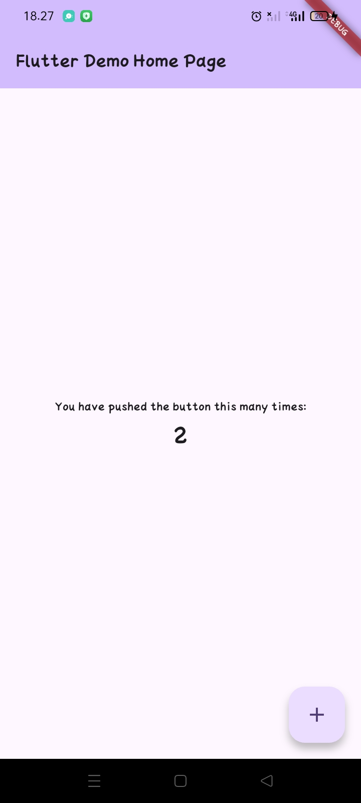
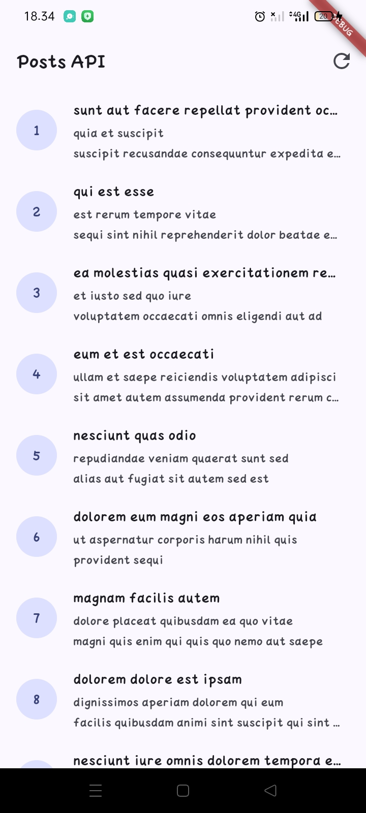
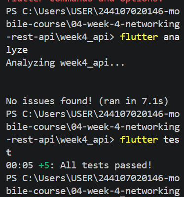
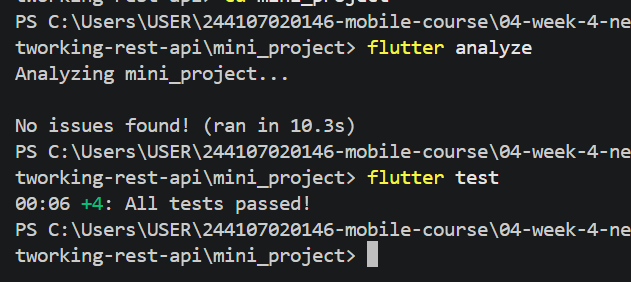

# Week 4
Nama: Yulike Dwi Nurcahyani
NIM: 244107020146
Kelas: TI - 3E

## Gambaran Projek
Projek ini merupakan latihan integrasi aplikasi Flutter dengan REST API. Aplikasi mengambil data post dan komentar dari JSONPlaceholder, mengubah respons JSON menjadi model Dart, serta menampilkan data dengan dukungan pemuatan bertahap (pagination). Latihan ini juga menerapkan pemisahan akses API melalui repository, pengelolaan state, dan penanganan error agar pesan kegagalan lebih mudah dipahami.

## Teknologi yang Digunakan
- **Flutter** dan **Dart** untuk membangun aplikasi.
- **Dio** untuk mengirim request HTTP ke REST API.
- **Riverpod** (`flutter_riverpod`) untuk mengelola state dan menyediakan dependency.
- **JSONPlaceholder** sebagai sumber data REST API.

## Praktikum 1: Dio dan model data

## Praktikum 2: Provider dan error handling

## Praktikum 3: Pagination dasar

## AI Challenge
https://claude.ai/share/7006c326-c247-4dbe-a5e7-1d8f4f18ae93

## Verifikasi
| Pertanyaan | Temuan | Perbaikan |
|---|---|---|
| UI memanggil Dio langsung? | Tidak ada UI di tugas ini; Dio hanya diakses lewat CommentRepository via dioProvider | - |
| fromJson aman null? | Pola `as num?` / `as String?` aman untuk null/hilang, tetapi crash jika tipe berubah (mis. `'abc' as num?` melempar TypeError) | Diganti helper `_asInt` / `_asString` berbasis `is` |
| Semua DioExceptionType dipetakan? | Timeout, connectionError, badResponse terpetakan; tipe lain lewat `default` | Memakai friendlyErrorMessage terpusat |
| baseUrl/timeout terpusat? | Ya, di createDio() | - |
| Test benar menguji field hilang? | (isi: apakah test AI hanya happy path?) | Tambah edge case: null + tipe salah + map kosong |
| flutter analyze / test | (isi hasil dan screenshot) | |

## Hasil testing

## Refactoring dan testing
Baris post kini menggunakan widget `PostTile` yang dapat dipakai ulang, pesan error jaringan dipusatkan di `network_errors.dart`, dan detail post tersedia melalui GoRouter pada `/post/:id`. Saat dibuka dari daftar, halaman menggunakan data post yang sudah dimuat; jika URL dibuka langsung, detail diambil melalui repository.

## Mini project / Industry Challenge
Mini project tersedia di folder [`mini_project`](./mini_project). Aplikasi Flutter mengambil post dari JSONPlaceholder melalui Dio dan repository, mengelola state dengan Riverpod, menampilkan state loading/error/empty/success, dan memuat data berikutnya dengan infinite scroll 10 post per halaman. Pengujian model, pemetaan error, dan provider menggunakan repository palsu tanpa koneksi internet.

## Refleksi
### 1. Mengapa UI tidak memanggil Dio langsung?
UI sebaiknya hanya mengurus tampilan dan interaksi, sementara repository menangani komunikasi API. Pemisahan ini membuat konfigurasi request dan penanganan respons berada di satu tempat, serta memungkinkan repository diganti dengan fake saat pengujian tanpa internet. Jika UI memanggil Dio sendiri, widget menjadi terikat pada detail jaringan; logika request dan error mudah terduplikasi, perilaku antarhalaman bisa tidak konsisten, dan pengujian UI menjadi lebih sulit.

### 2. Pagination client-side atau server-side?
Pagination client-side cukup jika seluruh dataset kecil, jumlah datanya terbatas, dan aman serta praktis untuk diambil sekaligus lalu difilter atau dibagi di perangkat. Untuk dataset besar atau terus bertambah, gunakan pagination server seperti `_page` dan `_limit`: aplikasi hanya mengunduh data yang sedang dibutuhkan sehingga pemakaian bandwidth dan memori lebih rendah dan waktu pemuatan awal lebih singkat. Mini project ini menggunakan pagination server dengan 10 post per halaman.

### 3. Bagaimana exception menjadi `AsyncError`?
Saat `AsyncNotifier.build()` atau `FutureProvider` mengembalikan `Future` yang gagal, Riverpod menangkap exception dan merepresentasikannya sebagai `AsyncError`. Karena itu widget dapat menangani loading, data, dan error melalui `when`, tanpa membungkus setiap pemanggilan provider dengan `try/catch`. `try/catch` eksplisit tetap berguna untuk aksi imperatif seperti memuat halaman berikutnya: di mini project, kegagalan pagination disimpan di state sambil mempertahankan post yang sudah tampil, lalu UI menyediakan aksi coba lagi.

### 4. Bagian hasil AI yang diperbaiki
Saya memperbaiki parsing model agar tidak hanya aman saat field null atau hilang, tetapi juga saat tipe JSON tidak sesuai: nilai diperiksa dengan `is num` atau `is String` sebelum digunakan, alih-alih cast yang dapat melempar `TypeError`. Saya juga memastikan pemetaan error jaringan terpusat dan menambahkan test provider dengan fake repository, sehingga test tidak melakukan request internet. Hasilnya diverifikasi dengan `flutter analyze` dan `flutter test`.
